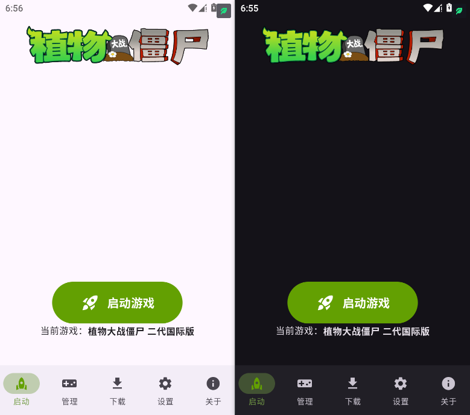

# Plants Vs. Zombies Launcher

<i>启动 · 管理 · 下载</i>

> 提供丰富的游戏库与高速下载功能。还可以统一管理、启动游戏

## 官方社群

> [!warning]
> PvzLauncher仅有这一个官方交流社群，如果您进入了其他未经验证的群可能会含有风险

**QQ**: 1040764053

## 💻 兼容情况

|操作系统|支持情况|备注|
|-|-|-|
| Android 7 及以上|✅支持|官方支持的操作系统，推荐 Android 8 及以上|
| Android 7 以下（不含Android 7）|❌不支持|系统太老，不支持新版本游戏以及部分功能|
| Windows|❌不支持|主线支持Windows: [跳转到主线仓库](https://github.com/PvzLauncher/PvzLauncher)|
| macOS /  IOS /  Web /  Linux  |❌不支持|永远也不会支持这些平台|

* **✅支持**: 程序可以在此平台完美运行，如出现问题会积极解决
* **❌不支持**: 程序不可以在这些平台上运行，之后也不会支持

## ✨ 特色功能

### 📥 下载游戏

我们拥有一个丰富且持续更新的游戏库。截至本文编写时，游戏库已收录数款可下载内容（包括**原版和改版**）。

所有资源均可通过启动器**免费、高速**下载，并在下载完成后自动安装，无需手动操作。

如果你没有在游戏库中找到想要的改版，欢迎通过 [Issue](https://github.com/PvzLauncher/PvzLauncher.Android/issues/new) 提交申请，我们会尽力将其添加到游戏库中。

### 📂 导入游戏

除了直接从启动器下载游戏外，你也可以将本地已有的游戏导入到启动器中进行统一管理。

## 🚀 快速开始

### 1. 运行时相关

此程序全部使用Kotlin编写，无需依赖**任何**运行时运行，因此在使用之前你无须担心任何有关运行时的问题！

### 2. 下载最新发行版

PvzLauncher**有且只有一条**下载通道，即为通过小飞机网盘下载，如您发现任何第三方下载渠道声称PvzLauncher的，均为**盗版**！

### 3. 安装与使用

此软件通过 `.apk` 软件包方式发布，如过您是通过**其他渠道**下载的 ，<b><u>请不要运行它！</u></b>其内部可能包含**未经验证的危险内容**！

确认下载的内容是安全的之后，您就可以直接安装了！

本程序需要依赖以下权限，请您**务必全部允许**
|权限名称|作用|
|-|-|
|应用内安装未知应用|为您安装不同的植物大战僵尸版本|
|读取应用列表|让您可以导入手机内现有的植物大战僵尸版本|
|访问网络|用于检测更新和访问云端游戏库|
|读写应用内部目录|用于配置文件的读写，记录您的自定义设置|
